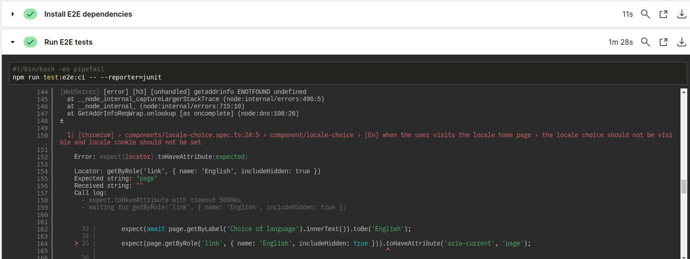

# pix-site

## Tests

Il y a des tests à plusieurs endroits dans ce projet.

### À la racine du projet

```shell
./tests.sh
```

### Dans le sous-répertoire `shared`

Lire la documentation dans ce répertoire.

### Possiblement dans le sous-répertoire `pix-site`

Lire la documentation dans ce répertoire.

### Possiblement dans le sous-répertoire `pix-pro`

Lire la documentation dans ce répertoire.

### Tests e2e

Les tests e2e utilisent Playwright.

#### Erreurs dans les tests e2e

Dans la CI il est surprenant de noter que certaines erreurs ne font pas échouer
la CI : 

 

De plus il est également surprenant de noter qu'en local l'exécution de la
commande `npm run test:e2e` provoque toujours des erreurs (par exemple `6
failed`) et renvoie toujours un code d'erreur.

Cela s'explique par le fait que Playwright dispose d'un mécanisme intégré de
gestion des flaky :
> "flaky" - tests that failed on the first run, but passed when retried

Le fonctionnement est donc le suivant : tant que l'ensemble des tests exécutés
par Playwright ne comporte pas de tests en erreur, l'exécution renvoie un code
de retour `0`, ce qui est une réussite par le shell. C'est à dire que, s'il y a
des `tests passed` et des `tests flaky` (par exemple `Error:
expect(locator).toBeVisible(), 5 flaky, 2 passed`), la CI considèrera que cette
exécution de tests e2e est une réussite, même si certaines exécutions de tests
sont indiquées en erreur.

De plus, les tests e2e sont exécutés dans CircleCI. Or CircleCI positionne une
variable d'environnement `CI`. Et cette variable est exploitée dans le fichier
`playwright.config.ts`. Aussi pour avoir des tests e2e aussi similaires que
possibles sur la CI et un poste de développement on a décidé de positionner
explicitement la variable `CI` dans le script npm `test:e2e:ci`.

